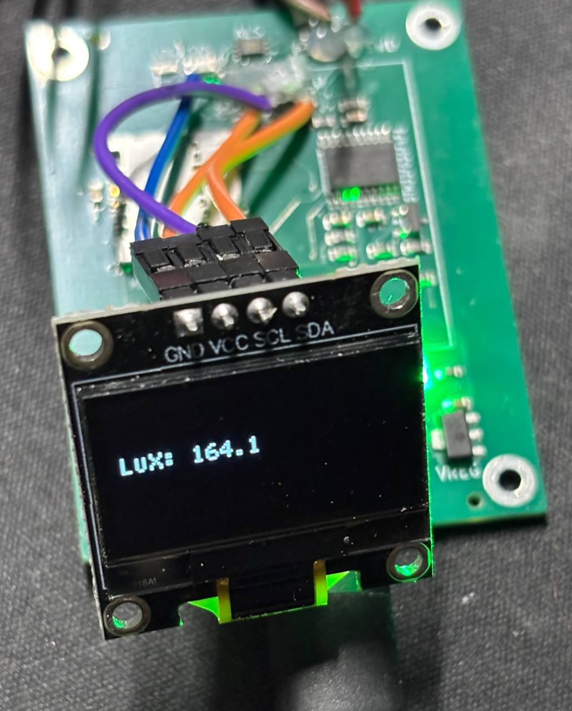
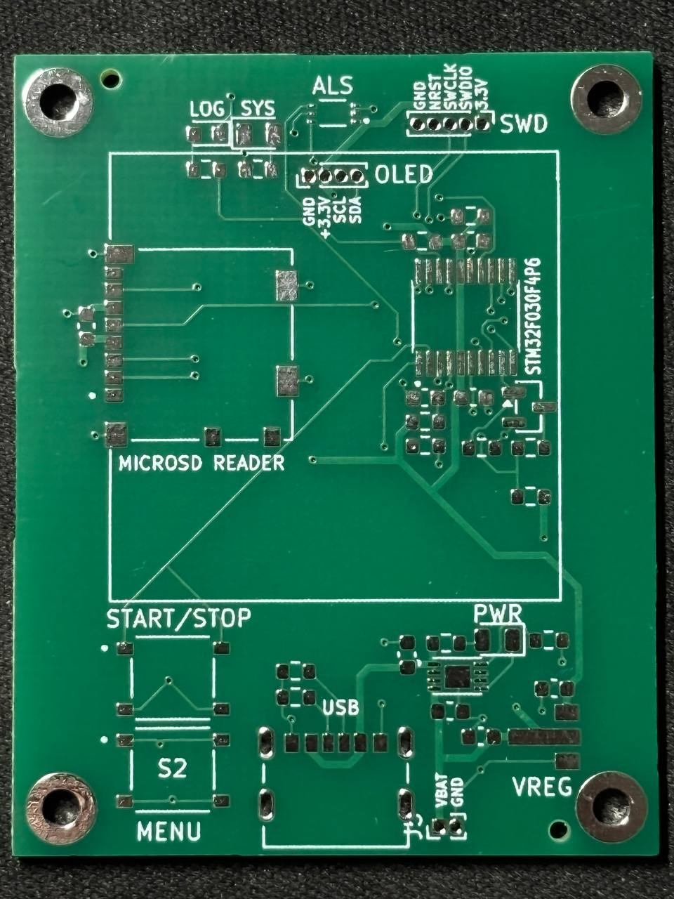
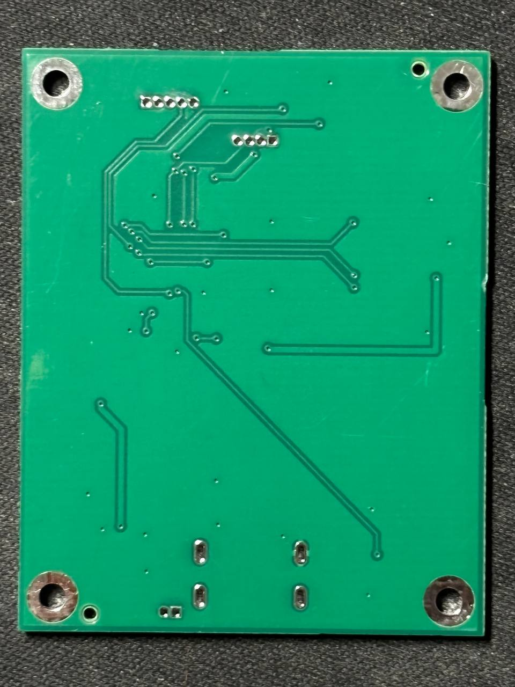
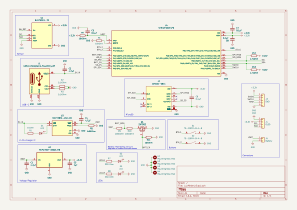

# LuxMeter v1.0 - Hardware Datasheet

  

**LuxMeter** started as a PCB design assignment for my *Fundamentals of Electronics* course.

The requirement was just to submit the layout files, but I decided to go all the way. I ordered the PCBAs and wrote the firmware.

This repository contains the hardware design files (KiCad), schematics, and manufacturing data.

---

## 📸 Gallery

| Top View | Bottom View |
| :---: | :---: |
|  | 

---

## 📐 Circuit Diagram (Schematic)

The full schematic design is available in the [`LuxMeter/`](./LuxMeter) folder.

  

---

## 🛠 Hardware Specifications

### Component Overview
Datasheets for key components are stored locally in the [`docs/`](./docs) directory.

| Component | Part Number | Function | Interface | Datasheet |
| :--- | :--- | :--- | :--- | :--- |
| **MCU** | **STM32F030F4P6** | Main Controller (Cortex-M0) | - | [View PDF](./docs/stm32f030f4.pdf) |
| **Sensor** | **BH1750FVI** | Digital Light Sensor | I2C1 | [View PDF](./docs/bh1750fvi-e-186247.pdf) |
| **Display** | **SSD1306 / SH1106** | 0.96" OLED Module | I2C1 | [View PDF](./docs/ssd1306.pdf) |
| **SD Slot** | **Molex 104031-0811** | MicroSD Card Connector | SPI1 | [View PDF](./docs/1040310811_sd.pdf) |
| **Charger** | **MCP73831** | Li-Po Charge Controller | - | [View PDF](./docs/MCP73831-Family-Data-Sheet-DS20001984H.pdf) |
| **LDO** | **MCP1700-3.3V** | Voltage Regulator | - | [View PDF](./docs/MCP1700-Data-Sheet-20001826F.pdf) |
| **MOSFET** | **2N7002** | Battery Monitor Switch | GPIO | [View PDF](./docs/NDS7002A-D.PDF) |

---

## 🔌 GPIO Map (Bare Metal)

### GPIO Table

| Pin | Name | Schematic Label | Function | Active Level / Notes |
| :--- | :--- | :--- | :--- | :--- |
| **PF0** | `BTN_1` | `BTN_1` | User Button 1 | **Low** (Requires Internal Pull-Up) |
| **PF1** | `BTN_2` | `BTN_2` | User Button 2 | **Low** (Requires Internal Pull-Up) |
| **PA0** | `BATT_MON` | `BATT_MON` | ADC Input (Chan 0) | Analog Voltage (Divided by 2) |
| **PA1** | `LED_R` | `LED_R` | User LED (Red) | **High** |
| **PA2** | `BATT_EN` | `BATT_EN` | Battery Monitor Enable | **High** (Enable measurement) |
| **PA3** | `BH_RST` | `BH_RST` | Sensor Reset / DVI | Check BH1750 Datasheet |
| **PA4** | `SD_CS` | `SD_CS` | MicroSD Chip Select | **Low** (Software Controlled) |
| **PA5** | `SPI1_SCK` | `SPI1_SCK` | SPI Clock | AF0 |
| **PA6** | `SPI1_MISO` | `SPI1_MISO` | SPI MISO | AF0 |
| **PA7** | `SPI1_MOSI` | `SPI1_MOSI` | SPI MOSI | AF0 |
| **PB1** | `LED_G` | `LED_G` | User LED (Green) | **High** |
| **PA9** | `I2C1_SCL` | `I2C1_SCL` | I2C Clock | AF4 (Open-Drain) |
| **PA10** | `I2C1_SDA` | `I2C1_SDA` | I2C Data | AF4 (Open-Drain) |
| **PA13** | `SWDIO` | `SWDIO` | SWD Debug Data |  |
| **PA14** | `SWCLK` | `SWCLK` | SWD Debug Clock |   |

---

## ⚙️ Subsystem Details

### 1. Battery Monitoring
To extend battery life, the voltage divider (100kΩ/100kΩ) is disconnected via a MOSFET (`Q1`) when not in use.

* **Formula:** $V_{batt} = ADC_{val} \times \frac{3.3V}{4095} \times 2$
* **Sequence:**
    1.  Set `PA2` HIGH.
    2.  Wait ~1ms for stabilization.
    3.  Read ADC on `PA0`.
    4.  Set `PA2` LOW immediately.

### 2. MicroSD Interface (Molex 104031-0811)
The board uses a push-push type Molex connector.
* **Bus:** SPI1 (max 18 Mbps, start initialization at <400 kHz).
* **Card Detect:** Not physically connected. Use software polling (try to mount) to detect card insertion.

### 3. I2C Bus (Sensors)
* **BH1750 Address:** `0x23` (ADDR pin grounded).
* **OLED Address:** Typically `0x3C` (verify with I2C scanner).

---

## ⚠️ Errata & Assembly Notes (Rev 1.0)

**Important notes for assembling the v1.0 PCB:**

1.  **Capacitor C6 Interference:**
    * **Issue:** The decoupling capacitor `C6` is placed directly in the insertion path of the MicroSD card. The physical height of the component blocks the card from entering the Molex slot.
    * **Workaround:** Simply remove (desolder) `C6`. The SD card interface functions correctly without it.
    
2.  **Incorrect Connector Pitch (OLED & SWD):**
    * **Issue:** The through-hole footprints for the **OLED Display** and **SWD Debug** header connectors were incorrectly assigned a **1.0mm pitch** instead of the standard **2.54mm**.
    * **Workaround:** I soldered wires directly to the connectors.

---

## 📂 Repository Structure

* `LuxMeter/` — Original KiCad project files (Schematic & PCB).
* `gerbers/` — Production files (Gerber/Drill) for ordering PCBs.
* `docs/` — PDF datasheets for components.
* `images/` — Photos and diagrams used in this README.
